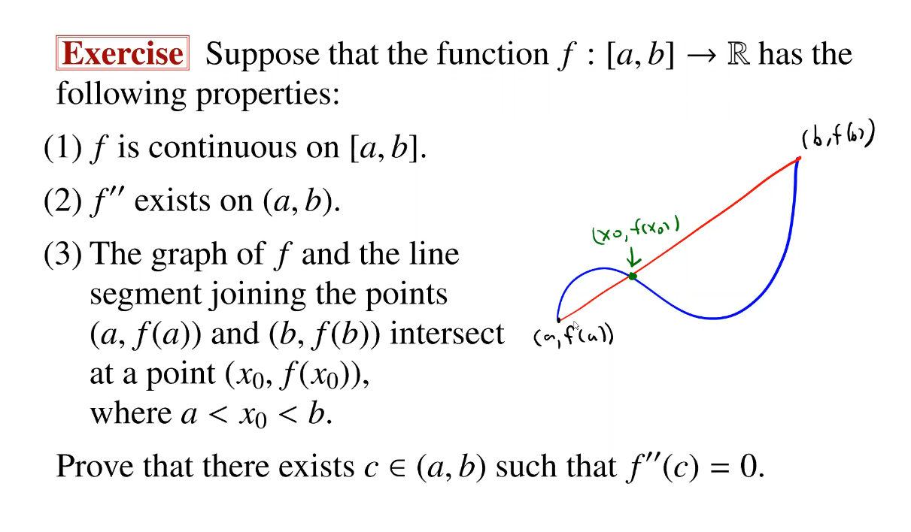

# Higher Derivatives

If $f$ is differentiable on an interval $I$, then its derivative $f'$ is a function on $I$.

So we can consider the differentiability of $f'$.

If $c \in I$ and $f'$ is differentiable at $c$, then we call the derivative of $f'$ at $c$ the **second derivative** of $f$ a $c$ and denote it by $f''(c)$ or $f^{(2)}(c)$. 
That is,

$$f''(c) := (f')'(c)$$

In general, if $n \in \N$, then the nth derivative $f^{(n)}(c)$ of $f$ at $c$ is defined as

$$f^{(n)}(c) := (f^{(n-1)})'(c)$$

So $f^{(n)}(c)$ exists if $(f^{(n-1)})'(c)$ exists in a neighborhood of $c$, and $f^(n-1)$ is differentiable at $c$.

## Notation

Let $I$ be an interval.

1. For $n \in \N$, let 

$$ C^n(I) = \{ f: f^{(n)} \text{ exists and is continuous on } I \}$$
2. Let
$$C^\infty (I) = \{ f: f^{(n)} \text{ exists and is continuous on } I \forall n \in \N \} = \bigcap^\infty_{n = 1} C^n(I)$$

If $f \in C^\infty(I)$, then we say that $f$ if **infinitely differentiable** on $I$.

> $C^0(I)$ or $C(I)$ is the collection of all continuous functions on $I$.

### Exercise

----------

By [[mean-value-theorem]], we have some $c_0 \in (a, x_0)$ and $c_1 \in (x_0, b)$ where $f'(c) = 0$.

Applying [[rolles-theorem]] we have $c \in (c_0, c_1)$ where $f''(c) = 0$.

## Second Derivative Test

Let $f$ be defined on an interval $I$ and let its derivative $f'$ exists on $I$.

Suppose that $c$ is an interior point of $I$ such that 
$f'(c) = 0$ and $f''(c)$ exists

1. If $f''(c) > 0$, then $f$ has a relative minimum at $c$.
2. If $f''(c) < 0$, then $f$ has a relative maximum at $c$.

> Nothing is said for $f''(c) = 0$.

### Proof

Apply [[ma3110-lemma-631]] to $f'$ for _(1)_.

Then we know that $f'(x) < f'(c) = 0$ for $x < c$ and vice versa.

By the [[first-derivative-test]], $f$ has a relative minimum at $c$.

[//begin]: # "Autogenerated link references for markdown compatibility"
[mean-value-theorem]: mean-value-theorem "Mean Value Theorem"
[rolles-theorem]: rolles-theorem "Rolle's Theorem"
[ma3110-lemma-631]: ma3110-lemma-631 "MA3110 Lemma 6.3.1"
[first-derivative-test]: first-derivative-test "First Derivative Test"
[//end]: # "Autogenerated link references"