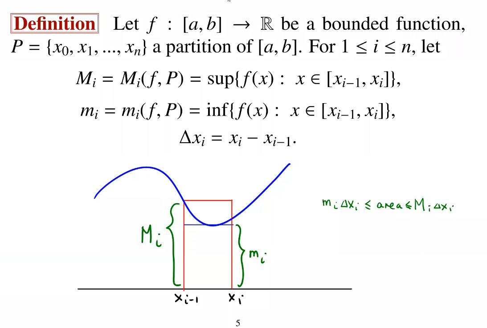

# Integration

## Defining Integration

1. upper sum and lower sum
2. Riemann sum

## Riemann Integral

- We want to find out the area under a curve
- We want to construct new functions with nice properties

Let $I = [a, b]$. A finite set $P = \{x_0, x_1, ..., x_n \}$ where $a = x_0 < x_1< ... < x_n = b$ is called a **partition** of $I$.

Define the **upper sum** of $f$ as 

$$U(f, P) = \sum^n_{i = 1} M_i \Delta x_i$$

Define the **lower sum** of $f$ as 
$$L(f, P) = \sum^n_{i = 1} m_i \Delta x_i$$

### Theorem 7.1.1

Let $f : [a, b] \rightarrow \R$ be a bounded function, $P$ a partition of $[a, b]$,

$m = \inf \{f(x) : x \in [a, b] \}$ and $M = \sup \{f(x) : x \in [a, b] \}$

Then

$$ m(b-a) \leq L(f, P) \leq U(f, P) \leq M(b - 1)$$

