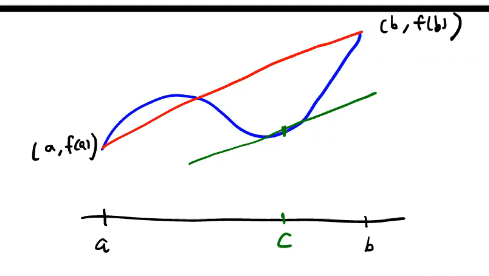

# Mean Value Theorem

If $f$ is continuous on $[a, b]$ and differentiable on $(a, b)$ and $f(a) = f(b)$, then there exists $c \in (a, b)$ such that
$$f'(c) = \frac{f(b) - f(a)}{b - a}$$

 > There must be some point $c$ where the tangent to that point is parallel to the gradient between the ends of the interval.

 

 > A more general form of [[rolles-theorem]]

 ## Proof

 Define $g : [a, b] \rightarrow \real$ by

 $$ g(x) = f(x) - \frac{f(b) - f(a)}{b - a} (x -a)$$

Then $g$ is a continuous function and differentiable on $(a, b)$.

 and $g(a) = g(b) = 0$.

 By [[rolles-theorem]], there exists $c \in (a, b)$ such that $g'(c) = 0$

 $$
 \begin{aligned}
   g'(x) &= f'(x) - \frac{f(b) - f(a)}{b - a} \\
   g'(c) &= f'(c) - \frac{f(b) - f(a)}{b - a} = 0\\
   \therefore f'(c) &= \frac{f(b) - f(a)}{b - a}
 \end{aligned}
 $$

 ## Applications
 ### Example

 Use Mean Value Theorem to show that 

 $$ e^x \geq 1 + x $$

 for all $x \in \real$.

----------

 Let $f(x) = e^x$, then $f'(x) = e^x$.

 #### Case 1: $x > 0$

 Applying [[mean-value-theorem]] to $f$ on $[0, x]$, there exists $c \in (a, b)$ such that

 $$ 
 \begin{aligned}
  f'(c) &= \frac{f(x) - f(0)}{x - 0} = \frac{e^x - 1}{x} \\
  \therefore e^x &= 1 + e^x
 \end{aligned}
 $$

[//begin]: # "Autogenerated link references for markdown compatibility"
[rolles-theorem]: rolles-theorem "Rolle's Theorem"
[mean-value-theorem]: mean-value-theorem "Mean Value Theorem"
[//end]: # "Autogenerated link references"