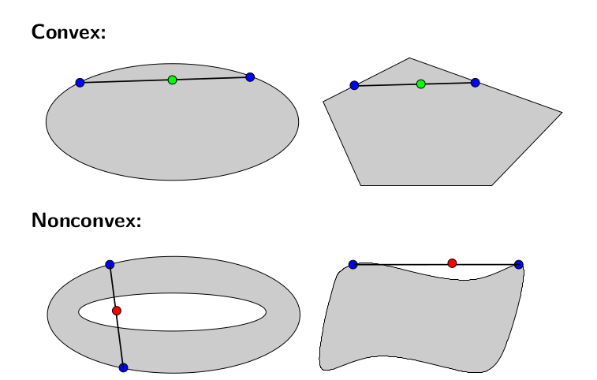
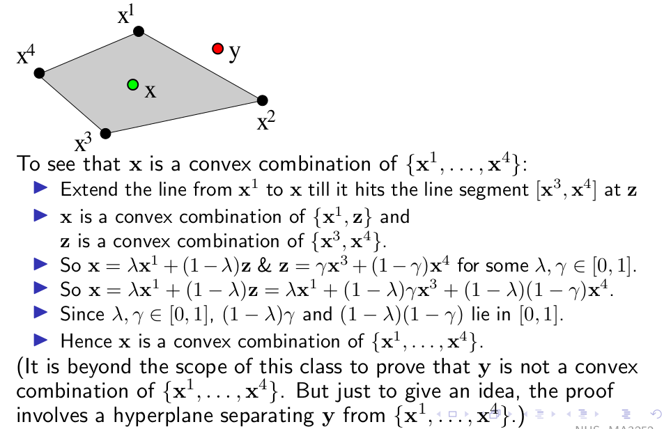
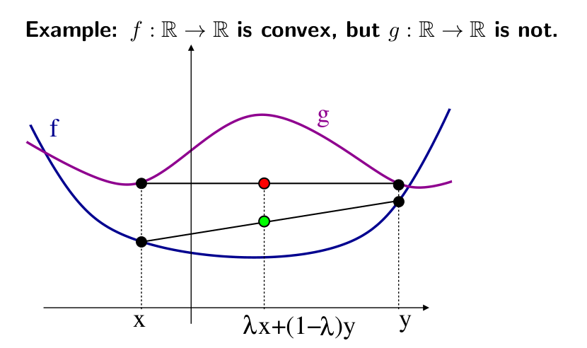

# Convex Sets and Functions

A set $S \subset \R^n$ is **convex** if for every $\bold{x, y} \in S$ and every $\lambda \in [0, 1]$, we have $\lambda \bold x + (1 - \lambda) \bold y \in S$.

> $S$ is convex if for all $\bold{x, y} \in S$ the line segment connecting them is a subset of $S$.

## Convex Combination

$\bold x \in \R^n$ is a **convex combination** of $\bold x^1, ..., \bold x^k \in \R^n$ iff $\bold x - \sum^k_{i = 1} \lambda_i \bold x^i$ where $\lambda_i \in [0, 1] \subset \R$ are such that $\sum^k_{i =  1} \lambda_i = 1$.

> To prove $\bold y$ not a convex combination, take some hyperplane $\bold c^T \bold y > b$ and $\bold c^T \bold x_i < b$
> 
> Then its not possible for $\bold y$ to be some linear combination of $\bold x_i$ such that $\bold c^T \bold x > b$.

> The feasible region of an LP is a convex set.

## Convex Function

A **convex function** satisfies 

$$ f(\lambda \bold x + (1 - \lambda) \bold y) \leq \lambda f(\bold x) + (1 - \lambda) f(\bold y) $$

for all $\bold{x, y} \in \R^n, \lambda \in [0, 1]$

> Convexity for a function means that the line segment connecting $(x, f(x))$ and $(y, f(y))$ is above the function $f$.

- $f$ is **concave** iff $-f$ is convex.
- Affine function $f(\bold x) = d + \bold c^T \bold x$ is both convex and concave.

> Expanding $f(\lambda x + (1 - \lambda)y) = \lambda f(x) + (1 - \lambda) f(y)$, both $\geq$ and $\leq$ is satisfied.

## Theorem

Let $f_1, ..., f_m : \R^n \rightarrow \R$ be convex functions.

Then the function

$$f(\bold x) := \max_{i = 1, ..., m} f_i(\bold x)$$

is also convex.

### Proof

Expanding $f(\lambda x - (1 - \lambda) y)$ and distributing the $\max$ function which is definition of $f$.

We get $\leq \lambda f(x) + (1 - \lambda)f(y)$.

## Corollary

The **piecewise affine function** $\max_{i = 1, ..., m}(\bold c_i^T \bold x + d_i)$ is convex.

### Proof

Use [last theorem](#theorem) and the observation that $f_i(x) := c_i^T x + d_i$ is convex.

