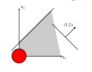

# Linear Programming

Linear Programming is an optimization technique for a system of linear constraints and a linear objective function.

Problems come in the form of 

$$
\begin{aligned}
  \min_{x \in \R^n} \; & \bold{c}^T \bold x \\
                       & \bold{A}_1^T = \bold b_1 \\
                       & \bold{A}_2^T \leq \bold b_2 
\end{aligned}
$$

## Graphical Representation

- In $\R^2$, $\{ \bold x \; \vert \; \bold a^T \bold x = b\}$ is a line perpendicular to $\bold a$.
- In $\R^3$, $\{ \bold x \; \vert \; \bold a^T \bold x = b\}$ is a plane with normal vector $\bold a$.
- In $\R^n$, $\{ \bold x \; \vert \; \bold a^T \bold x = b\}$ is a hyperplane with normal vector $\bold a$.

Vector $\bold c$ corresponds to direction of increasing $\bold c^T x$.

## General Linear Programing Problem

A **Linear Programming** problem is of the form

$$
\begin{aligned}
  \min_{x \in \R^n} \text{ or max } \; & \bold{c}^T \bold x \\
                       & \bold{a}_i^T \geq \bold b_i \\
                       & \bold{a}_i^T \leq \bold b_i \\
                       & \bold{a}_i^T = \bold b_i \\
                       & x_j \geq 0 \\
                       & x_j \leq 0 \\
                       & x_j \in \R \\
\end{aligned}
$$

There are
- **finitely may** linear equality and inequality **constraints**.
- $\bold c \in \R$ is a given **cost** (or profit) **vector**
- The **objective** is to minimize (or maximize) $\bold c^T \bold x$
- The function $\bold c^T \bold x$ is the **objective function**.

## Terminology

- Each $x$ is a **decision variable**.
- Variables $x_j$ for which $x_j \in \R$ are **free** or **unrestricted**.
- A vector $\bold x$ satisfying all constraints is a **feasible solution** or a **feasible vector**.
- The **feasible set** or **feasible region** is the set of all feasible solutions.
  - A feasible solution $\bold x^*$ that minimizes teh objective function is an **optimal feasible solution** or **optimal solution**.
  - The value $\bold c^T \bold x^*$ is **optimal objective value** or **optimal cost**.
- For a minimization problem, the cost is **unbounded** if for very $K \in \R$, there is a feasible $x$ sucht that $\bold c ^T \bold x < K$
  - Or the optimal cost is $-\infty$.

> Note that we can phrase all maximization problems as minimization problems.
>
> $\max \bold c^T \bold x = - \min -\bold c^T \bold x$

## Possible Outcomes of LP

### Unique Solution

### Multiple Optimal Solutions

- Set of optimal solutions can be **bounded** or **unbounded**.
  - Even then, optimal value $\bold c^T \bold x$ takes only one finite value.

### Optimal Cost Unbounded

- No feasible solution optimal

> Optimal cost is $-\infty$.

### Unfeasible

The feasible set is empty.

> In such a case, the optimal value is $\infty$.

> For maximization problems, unbounded: $\infty$; infeasible: $-\infty$

## Formulating a LP model

1. Identify unknown variables
2. Identify all constraints or restrictions
3. Identify the objective or criterion

> In this calss, we may formulate integer programs (variables must be integers), but we only solve linear programs.

## Transformations and Standard Form Problems

Rewrite all the inequalities as some $x_1 + x_2 + ... +x_n \geq b_i$

Then we have a **compact form** $\bold{Ax} \geq \bold b$.

### Standard Form

An LP is converted into standard form by these steps

1. Eliminate **inequality constraints**
   - Introduce a new slack variables $s_i$.
   - $\bold a_i^T \bold x \leq b_i$ becomes $\begin{cases} \bold a_i^T \bold x + s_i = b_i \\ s_i \geq 0 \end{cases}$
2. Eliminate **nonpositive** and **free variables**.
   - Replace $x_i \leq 0$ with $-x_i^-$
   - For free variables, introduce 2 new positive variables $x_i^+$ and $x_i^-$.

> - The general (compact) form $\bold{Ax} \geq \bold b$ is often used to develop the theory of linear programming
> - The standard form $\bold{Ax} = \bold b, \bold x \geq \bold 0$ is computationally convenient for algorithms like the simplex method.

#### Visualizing Standard Form Problems

The new slack variables $s_i$ help us identify where the constraints are tight (aka at the boundaries).

- If all $s_i > 0$ and $x_i > 0$, then point is in the **interior**.
- 2 of 4 variables equalling 0 corresponds to a **corner point**.